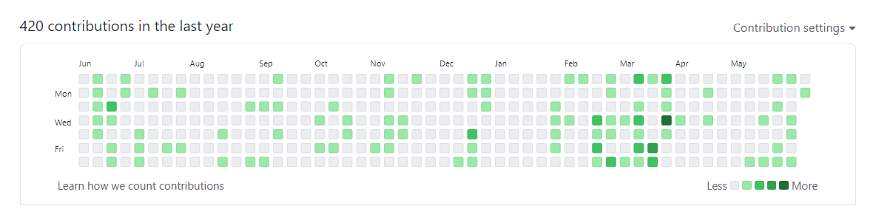
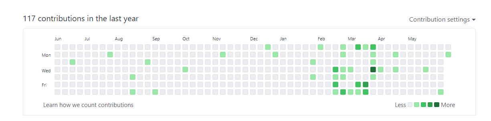
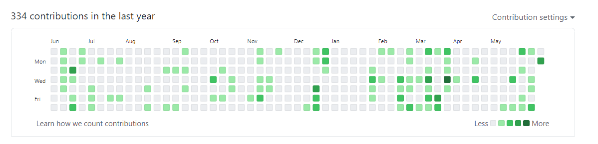

# fix_contributions

After I changed my github email, my contributions disappeared.

Before:

After:

I have tried to fix the problem with this script:

## References

<https://www.git-tower.com/learn/git/faq/change-author-name-email/>
